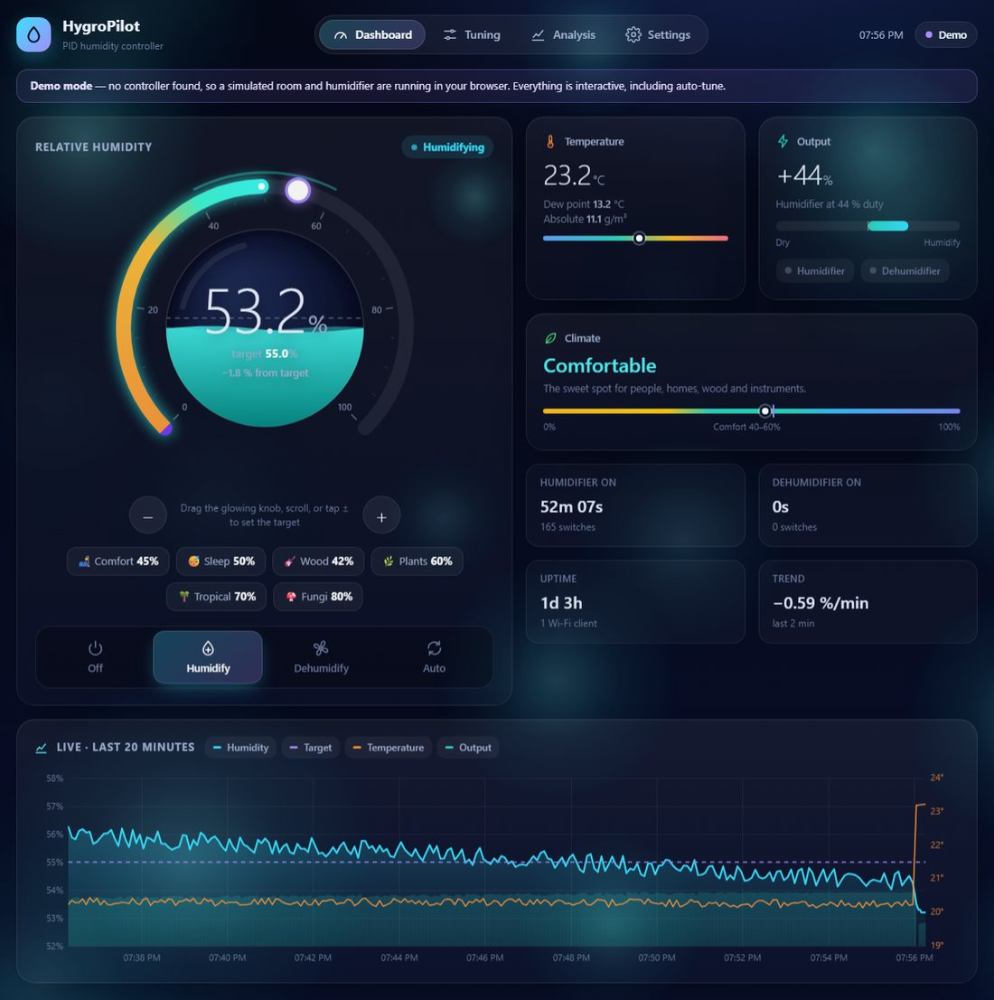
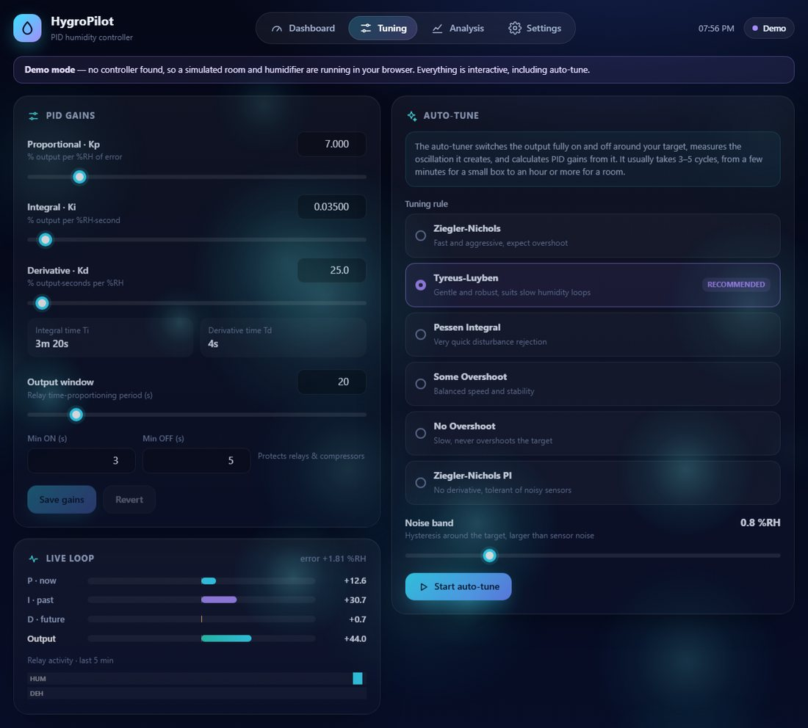
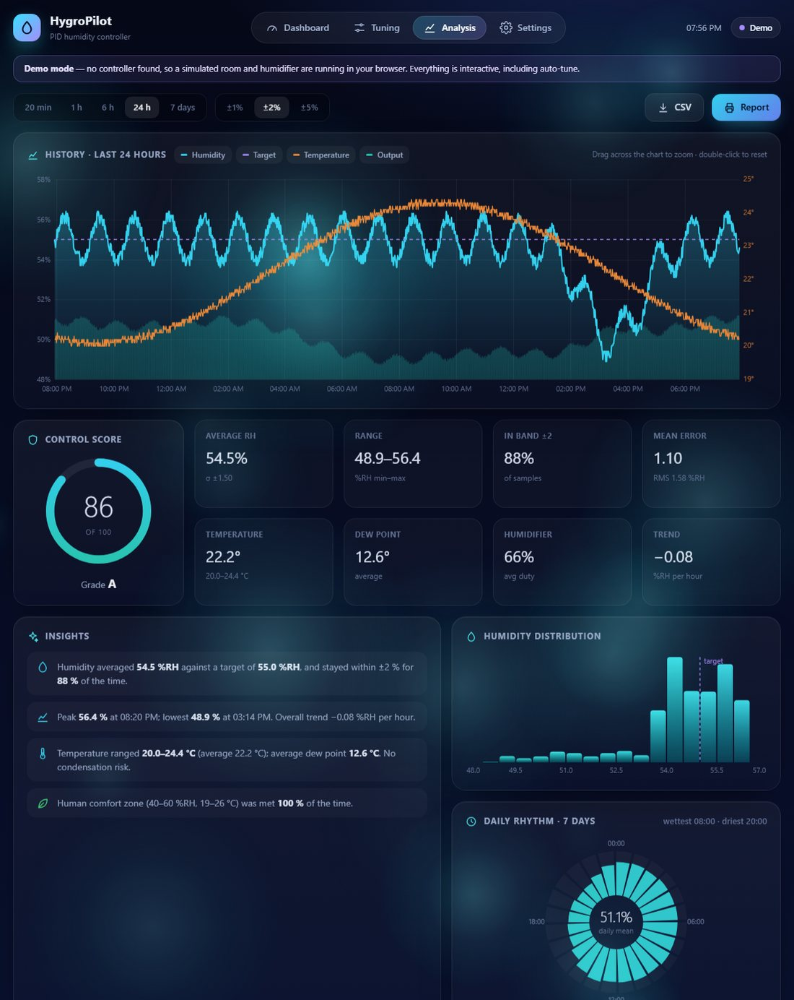
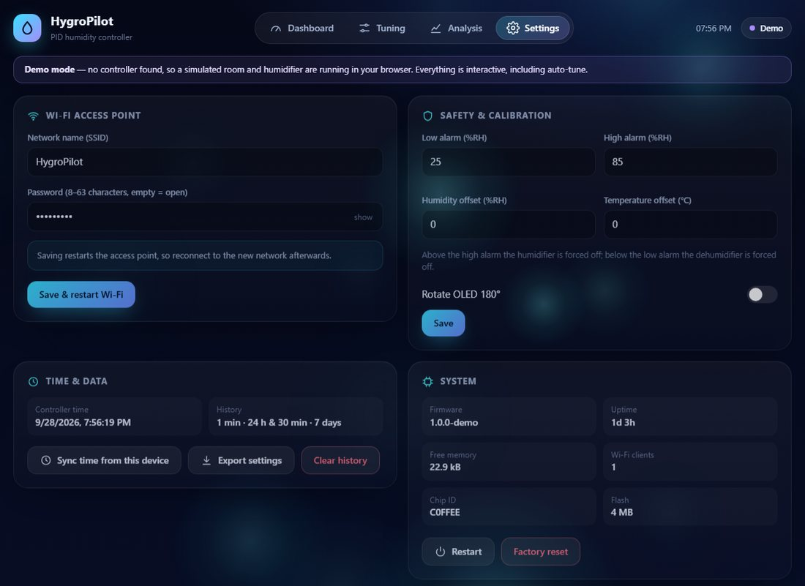
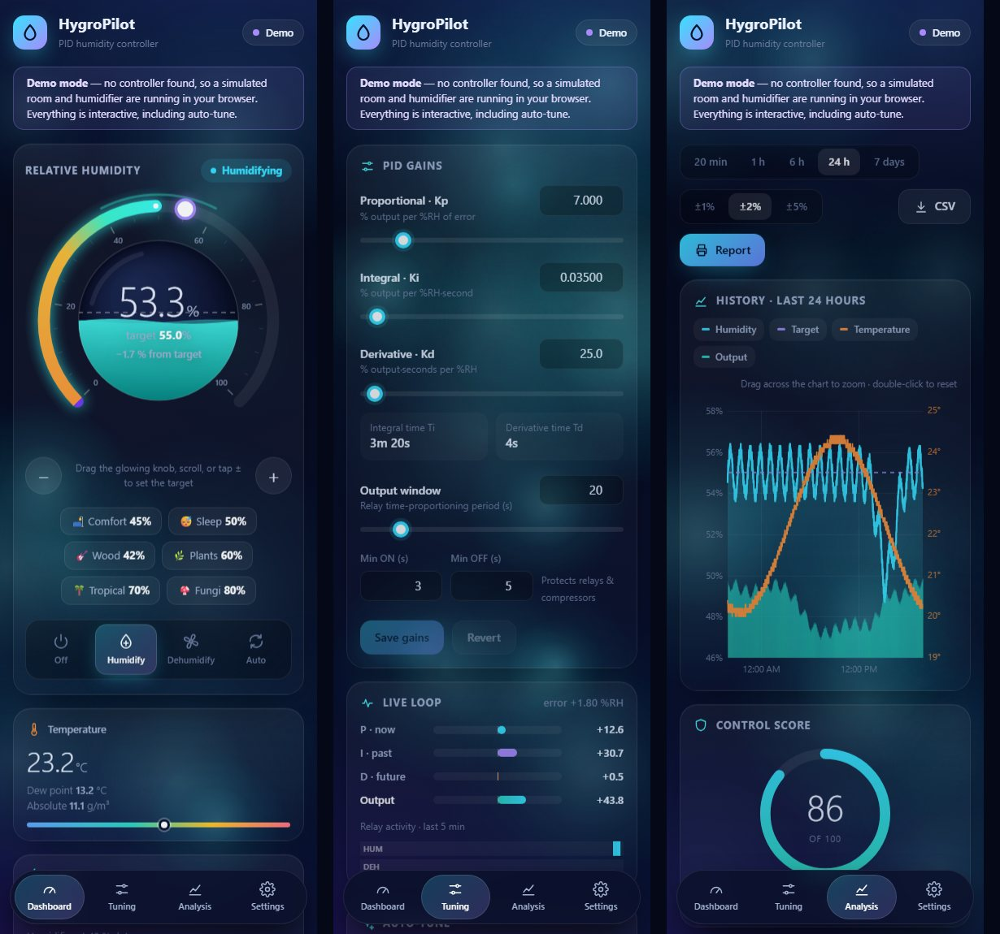
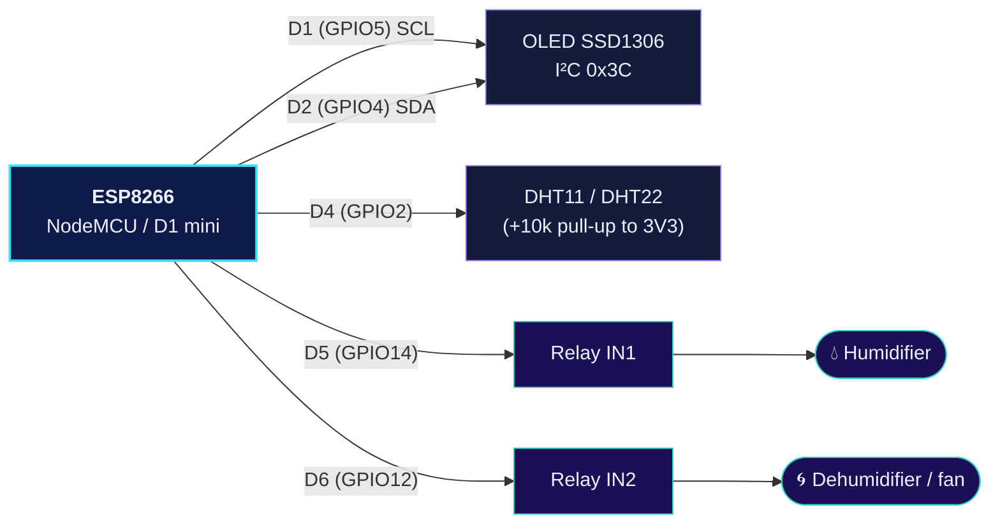
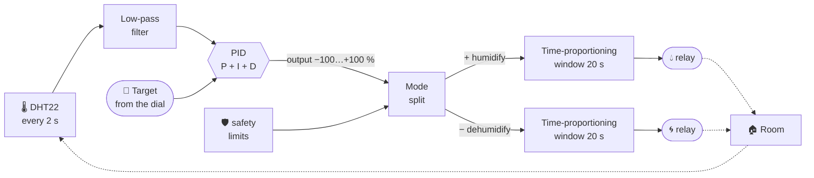
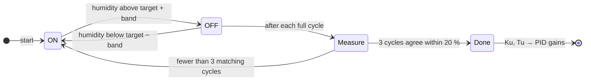
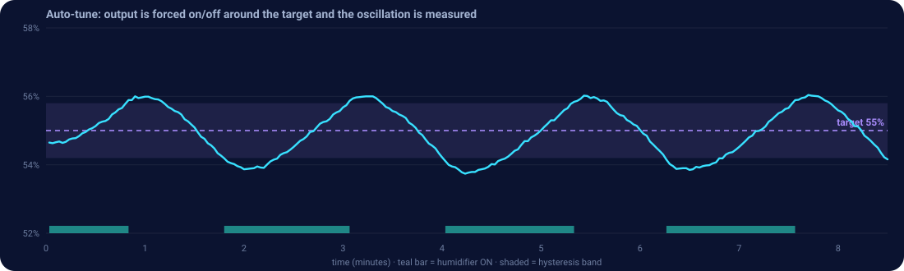
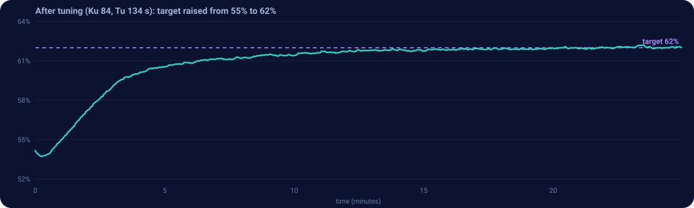

<p align="center">
  
</p>

<p align="center">
  
  
  
  
  
</p>

<p align="center">
  <b>Set a humidity. It holds it. If it isn't holding well, it tunes itself.</b><br>
  Connect to its Wi-Fi from any phone, drag a dial, and watch the room follow.<br><br>
  <a href="https://am4l-babu.github.io/humidity-controller/"><b>▶ Live demo</b></a> ·
  <a href="#-try-it-in-30-seconds">Try it</a> ·
  <a href="#-build-it">Build it</a> ·
  <a href="#-how-it-works">How it works</a> ·
  <a href="#-the-dashboard">Dashboard</a> ·
  <a href="#-faq--troubleshooting">FAQ</a>
</p>

---

## ✨ What you get

| | |
|---|---|
| 🎯 **Set it and forget it** | Drag the dial to a target humidity. A PID loop switches a humidifier (and optionally a dehumidifier or fan) to hold it. |
| 🧠 **Auto PID tune** | One tap. The controller forces an oscillation, measures it, and calculates the gains. Choose from six tuning rules. |
| 📡 **Its own Wi-Fi** | It creates an access point with a captive portal. No router, no internet, no app. The dashboard opens when you connect. |
| 🖥️ **OLED display** | Big live humidity, target, temperature, trend and output bar, plus a 20-minute graph page and a Wi-Fi info page. |
| 📊 **Analysis report** | Past temperature and humidity for 20 min up to 7 days, with a control score, plain-language insights, CSV export and a printable report. |
| 🛡️ **Safe by default** | High and low humidity lockouts, sensor-fault shutdown, and relay minimum on/off times. |
| 💾 **Survives power cuts** | Settings, tuning and the 24 h and 7-day history are saved to flash. |

<br>

## 🖼️ The dashboard

<p align="center">
  
</p>

The gauge is the control. **Drag the glowing knob** (or scroll, use the arrow keys, or tap a preset like 🌿 Plants 60%). The water level inside shows the real humidity, bubbles rise while the humidifier runs, and the whole page background shifts colour from amber (dry) through teal (comfortable) to violet (humid).

<details>
<summary><b>🎛️ Tuning page</b>: live P / I / D contributions, six tuning rules, one-tap auto-tune</summary>
<br>
<p align="center"></p>

Move a slider and the integral and derivative times update instantly. The **Live loop** panel shows how much of the output comes from the present error (P), the accumulated error (I) and the rate of change (D), plus a strip of relay activity for the last 5 minutes.
</details>

<details>
<summary><b>📈 Analysis page</b>: zoomable history, control score, insights, distribution and daily rhythm</summary>
<br>
<p align="center"></p>

- **Drag across the chart to zoom**, double-click to reset, and click a legend chip to hide a series.
- The **control score** blends how often humidity stayed inside your tolerance band (±1, ±2 or ±5 %) with the average error.
- **Insights** are generated from the data. For example: "the humidifier ran at 92 % duty and may be undersized", or "humidity sat 2 % above target and a humidifier can't lower it. Consider Auto mode."
- The **daily rhythm** ring shows your average humidity for each hour of the day, over the last 7 days.
- **CSV** downloads the range you are looking at, and **Report** opens a print-ready page with the chart, the key figures and the insights.
</details>

<details>
<summary><b>⚙️ Settings page</b>: Wi-Fi name and password, alarms, calibration, clock sync</summary>
<br>
<p align="center"></p>
</details>

<details>
<summary><b>📱 On a phone</b></summary>
<br>
<p align="center"></p>

Below 720 px the tabs become a bottom bar and the cards stack.
</details>

<br>

## 🚀 Try it in 30 seconds

### ▶ [Open the live demo](https://am4l-babu.github.io/humidity-controller/)

You don't need any hardware to see the interface. The link above runs the real dashboard in your browser against a simulated room. Or run it locally by cloning the repo and opening one file:

```bash
git clone https://github.com/Am4l-babu/humidity-controller.git
cd humidity-controller
# double-click web/index.html, or:
start web/index.html        # Windows      (open on macOS, xdg-open on Linux)
```

With no controller to talk to, the page switches to **demo mode**. A simulated room, humidifier and sensor run right in your browser, so the dial, tuning, auto-tune and the 7-day analysis all work. Add `?demo` to the URL to force it.

> 💡 Set a mode, open **Tuning → Start auto-tune** and watch it tune itself. In the demo it takes about ten minutes.

<br>

## 🔧 Build it

### Parts

| Part | Notes |
|---|---|
| NodeMCU v2/v3 **or** Wemos D1 mini | Any ESP8266 with 4 MB flash |
| DHT11 or DHT22 (AM2302) | Or an SHT31. Pick the model with `DHT_MODEL` (default `DHT11`) and the sensor with `SENSOR_TYPE` in [config.h](HumidityController/config.h) |
| SSD1306 OLED, 128×64, I²C | 0.96", address `0x3C` |
| 1 or 2 channel relay module | Or a logic-level MOSFET for a USB mister. The 2nd channel is for a dehumidifier or exhaust fan. |
| Humidifier | It must run on its own when power is applied |
| 10 kΩ resistor | DHT data pull-up (many breakout boards already have it) |

### Wiring



| ESP8266 pin | GPIO | Connects to |
|---|---|---|
| D1 | 5 | OLED **SCL** (and SHT31 SCL) |
| D2 | 4 | OLED **SDA** (and SHT31 SDA) |
| D4 | 2 | DHT **DATA** (the on-board LED shares this pin, so it is disabled) |
| D5 | 14 | Relay **IN1**: humidifier |
| D6 | 12 | Relay **IN2**: dehumidifier / fan (optional) |
| D3 | 0 | On-board FLASH button: flips OLED pages |
| 3V3 / VIN / GND | – | OLED and DHT on 3V3, relay module on VIN (5 V), common ground |

Most blue relay boards switch **on** when their input is pulled **low**. That is the default (`RELAY_ACTIVE_LOW 1`). For an active-high board or a MOSFET, set it to `0`.

> [!WARNING]
> **Mains voltage.** Switching a 230 V / 120 V humidifier through a relay means live mains wiring. Use an enclosed relay board rated for the load, keep the low-voltage and mains sides apart, and if you are not qualified, use a low-voltage USB mister with a MOSFET, or a pre-built relay plug.

### Flash it

<details open>
<summary><b>PlatformIO</b> (recommended)</summary>

```bash
pio run -t upload            # NodeMCU (default)
pio run -e d1_mini -t upload # Wemos D1 mini
pio device monitor           # serial log at 115200
```

Before each build, `tools/embed_web.py` gzips `web/index.html` into the firmware (about 34 KB), so you only ever edit the HTML file.
</details>

<details>
<summary><b>Arduino IDE</b></summary>

1. Install the **esp8266** board package (*Boards Manager → "esp8266 by ESP8266 Community"*).
2. Install the libraries: **Adafruit SSD1306**, **Adafruit GFX**, **DHT sensor library**, **Adafruit Unified Sensor**, and **Adafruit SHT31** if you use that sensor.
3. Open `HumidityController/HumidityController.ino`.
4. Choose *NodeMCU 1.0* or *LOLIN(WEMOS) D1 mini* with **Flash Size: 4MB (FS:1MB)**.
5. Upload.

The web page is already embedded in `HumidityController/webpage.h`. If you edit `web/index.html`, run `python tools/embed_web.py` to regenerate it.
</details>

### First run

1. Power up. The OLED shows the splash, then live readings.
2. Join the Wi-Fi **`HygroPilot`** (password **`hygro1234`**). The dashboard pops up, or browse to **http://192.168.4.1** (or `http://hygropilot.local`).
3. The page sets the controller's clock from your phone so the history gets real timestamps.
4. Choose **Humidify**, **Dehumidify** or **Auto** (uses both relays) and drag the dial to your target.
5. Go to **Tuning → Start auto-tune** and leave the room undisturbed until it says *Tuned successfully*.
6. Change the Wi-Fi name and password in **Settings**.

<br>

## 🧠 How it works



- **PID.** Derivative acts on the measurement, so changing the target never causes a kick. The D term is filtered, and the integral stops accumulating when the output is saturated (anti-windup).
- **Time-proportioning.** A relay can't be half on, so a 30 % output means "on for 6 s of every 20 s". Minimum on and off times protect relays and compressors.
- **Safety.** Above the high alarm the humidifier is locked out. Below the low alarm the dehumidifier is locked out. Five failed sensor reads in a row switch both outputs off.

### Auto-tune

Humidity loops are slow and lag behind the actuator, so trial and error is painful. The tuner uses the **relay-feedback method** (Åström–Hägglund):



<p align="center">
  
</p>

The switching forces a steady oscillation. Its amplitude *a* and period *T<sub>u</sub>* give the ultimate gain:

> **K<sub>u</sub> = 4d / (π · √(a² − band²))**, where *d* is half the output swing

Then your chosen rule turns *K<sub>u</sub>* and *T<sub>u</sub>* into gains. The result is stored, so you can try other rules without re-tuning:

| Rule | Character | Best for |
|---|---|---|
| Ziegler-Nichols | Fast, overshoots | Small, fast boxes |
| **Tyreus-Luyben** ⭐ | Gentle and robust | Most rooms. **Default.** |
| Pessen Integral | Aggressive disturbance rejection | Leaky spaces |
| Some Overshoot | Balanced | General use |
| No Overshoot | Slow, never overshoots | Fragile things (instruments, cigars, film) |
| Ziegler-Nichols PI | No D term | Noisy sensors |

<p align="center">
  
</p>

<sub>Both charts above come from the browser simulator, which runs a JavaScript port of the firmware's PID and tuner. A real room will give different numbers.</sub>

**Tips.** Pick a target the humidifier can clearly reach. Keep doors and windows closed during the run. Set the noise band above your sensor's jitter (0.5–1.0 %RH for a DHT22).

<br>

## 🔌 Web API

The dashboard is a client of a small REST API, so you can script the controller or wire it into Home Assistant, Node-RED and similar tools.

<details>
<summary><b>Endpoints</b></summary>
<br>

| Method | Path | Parameters |
|---|---|---|
| GET | `/api/status` | Live JSON: readings, output, PID terms, tuner state, counters |
| GET | `/api/config` | All settings |
| GET | `/api/history?r=f\|m\|l` | CSV of the last 20 min / 24 h / 7 days |
| POST | `/api/set` | `sp` (5–95), `mode` (0 off, 1 humidify, 2 dehumidify, 3 auto) |
| POST | `/api/pid` | `kp`, `ki`, `kd`, `win`, `mon`, `moff` |
| POST | `/api/tune` | `act=start\|stop\|apply`, `rule` (0–5), `band` |
| POST | `/api/settings` | `ssid`, `pass`, `alo`, `ahi`, `hoff`, `toff`, `flip` |
| POST | `/api/time` | `epoch`, `tz` (minutes east of UTC) |
| POST | `/api/clear`, `/api/reboot`, `/api/factory` | none |

POST bodies are form-encoded:

```bash
curl -X POST http://192.168.4.1/api/set -d "sp=52&mode=1"
curl http://192.168.4.1/api/status
curl -X POST http://192.168.4.1/api/tune -d "act=start&rule=1&band=0.8"
```
</details>

<details>
<summary><b>Memory and history layout</b></summary>
<br>

| Buffer | Resolution | Span | Stored in flash |
|---|---|---|---|
| Fine | 5 s | 20 minutes | no (RAM only) |
| Medium | 1 min | 24 hours | yes, every 10 min |
| Long | 30 min | 7 days | yes, every 10 min |

Each sample is 10 bytes: time, temperature, humidity, output and target. The whole firmware, history buffers included, uses about 51 KB of the ESP8266's 80 KB RAM.
</details>

<br>

## ❓ FAQ & troubleshooting

<details>
<summary><b>The page doesn't pop up when I join the Wi-Fi.</b></summary>
<br>
Open a browser and go to <code>http://192.168.4.1</code> manually. Some phones suppress captive portals on networks they think have no internet. Turn off mobile data if the phone keeps jumping back to it.
</details>

<details>
<summary><b>The page says "Reconnecting…" or shows no data.</b></summary>
<br>
The page can't reach <code>/api/status</code>. Check that you are on the HygroPilot network (not mobile data or your home Wi-Fi) and that the URL is <code>http://192.168.4.1</code>, not <code>https</code>. The ESP8266 serves one request at a time, so close other tabs that point at it. If the page is opened from anywhere else (a file, another server) it falls back to demo mode instead.
</details>

<details>
<summary><b>The OLED is blank.</b></summary>
<br>
Check SDA/SCL (D2/D1) and the address. Most modules use <code>0x3C</code>. A few use <code>0x3D</code>, so change <code>OLED_ADDR</code> in <code>config.h</code>.
</details>

<details>
<summary><b>Sensor fault / humidity reads "--".</b></summary>
<br>
Check the DHT data wire (D4) and the 10 kΩ pull-up to 3V3. After 5 failed reads the outputs are switched off on purpose.
</details>

<details>
<summary><b>The humidifier is on when it should be off (or the reverse).</b></summary>
<br>
Your relay board is probably active-high. Set <code>RELAY_ACTIVE_LOW</code> to <code>0</code> in <code>config.h</code>.
</details>

<details>
<summary><b>Auto-tune says "Setpoint unreachable".</b></summary>
<br>
The humidifier can't reach the target, either because the target is too high for the space or the humidifier is too small. Lower the target, or try a smaller room or box, and start again.
</details>

<details>
<summary><b>Humidity oscillates or overshoots after tuning.</b></summary>
<br>
On the Tuning page, switch to a calmer rule (<b>No Overshoot</b>) or lengthen the <b>output window</b>. Compressor dehumidifiers also need <b>Min OFF ≥ 180 s</b>.
</details>

<details>
<summary><b>The history timestamps look wrong after a power cut.</b></summary>
<br>
The ESP8266 has no battery-backed clock. It estimates the time from the last flash save, and the dashboard corrects it the next time you open the page (or press <i>Sync time</i> in Settings).
</details>

<details>
<summary><b>I forgot the Wi-Fi password.</b></summary>
<br>
If you can still reach the page, use <b>Settings → Factory reset</b>. Otherwise erase the flash and upload again (<code>pio run -t erase</code>, then <code>pio run -t upload</code>). That restores <code>HygroPilot</code> / <code>hygro1234</code> and clears all history.
</details>

<br>

## 📁 Project layout

```
HumidityController/
├── HumidityController.ino   sensor, control loop, OLED, Wi-Fi, web API
├── config.h                 pins, sensor choice, timing
├── settings.h               persistent settings (LittleFS)
├── control.h                PID, relay auto-tuner, time-proportioning output
├── history.h                ring buffers, persistence, CSV streaming
├── jsonw.h                  tiny JSON writer
└── webpage.h                generated: the gzipped web UI
web/index.html               the whole UI, plus a built-in simulator for demo mode
tools/embed_web.py           gzips the UI into webpage.h at build time
docs/                        README images
platformio.ini
```

## 🧪 Status

- [x] Firmware builds for NodeMCU v2 and Wemos D1 mini (about 41 % of flash, 63 % of RAM)
- [x] Web UI and a JavaScript port of the PID and auto-tune logic exercised end to end in the browser simulator (auto-tune converged in 3 cycles, then held a 62 % target within 0.06 %RH)
- [x] PID, auto-tune, safety limits, history, captive portal, OLED pages, REST API
- [ ] Bench-tested on real hardware. The C++ firmware has been compiled but not yet run on a board, so wiring, sensor and relay behaviour may need small tweaks. Please open an issue if something doesn't behave
- [ ] Optional: MQTT / Home Assistant discovery
- [ ] Optional: station-mode Wi-Fi alongside the access point

<br>

<p align="center">
  Made by <a href="https://github.com/Am4l-babu"><b>Am4l-babu</b></a> 💧
</p>
